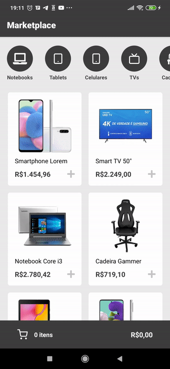

<h1 align="center">
    Marketplace
</h1>

<p align="center">
  <a href="#computer-projeto">Projeto</a>&nbsp;&nbsp;&nbsp;|&nbsp;&nbsp;&nbsp;
  <a href="#rocket-tecnologias">Tecnologias</a>&nbsp;&nbsp;&nbsp;|&nbsp;&nbsp;&nbsp;
  <a href="#thinking-como-contribuir">Como contribuir</a>&nbsp;&nbsp;&nbsp;|&nbsp;&nbsp;&nbsp;
  <a href="#gear-como-configurar-e-executar">Como configurar e executar</a>&nbsp;&nbsp;&nbsp;|&nbsp;&nbsp;&nbsp;
  <a href="#memo-licença">Licença</a>
</p>

<br/>

<p align="center">
  

  

  

  <a href="https://github.com/Diziano/marketplace-react-native/commits/master">
    
  </a>

  <a href="https://github.com/Diziano/marketplace-react-native/issues">
    
  </a>

  

</p>

<br/>

<h3>
  
</h3>

<br/>


## :computer: Projeto
Esta é uma aplicação conceitual de marketplace, desenvolvida com objetivos didáticos, onde é possível:
- Explorar produtos;
- Filtrar produtos por categoria;
- Adicionar produtos ao carrinho;
- Visualizar e manipular produtos no carrinho.

<br/>

## :rocket: Tecnologias
Esse projeto foi desenvolvido com as seguintes tecnologias:

- [React Native](https://github.com/facebook/react-native)
- [TypeScript](https://github.com/microsoft/TypeScript)
- [styled-components](https://github.com/styled-components/styled-components)
- [JSON Server](https://github.com/typicode/json-server)
- [axios](https://github.com/axios/axios)
- [ESLint](https://github.com/eslint/eslint)
- [Prettier](https://github.com/prettier/prettier)

<br />

## :thinking: Como contribuir

- Faça um fork desse repositório;
- Cria uma branch com a sua feature: `git checkout -b minha-feature`;
- Faça commit das suas alterações: `git commit -m 'feat: Minha nova feature'`;
- Faça push para a sua branch: `git push origin minha-feature`.

Depois que o merge da sua pull request for feito, você pode deletar a sua branch.

<br/>

## :gear: Como configurar e executar

```bash

    # Clonar o repositório
    $ git clone https://github.com/Diziano/marketplace-react-native.git

    # Navegar para o diretório
    $ cd marketplace-react-native

    # Instalar as dependências
    $ yarn install

    # Executar servidor fake (JSON Server)
    $ yarn start:server

    # Se preferir executar o servidor em um IP específico
    $ yarn json-server server.json -p 3333 --host SEU_IP

    # Instalar as dependências para iOS (em sistema iOS)
    $ cd ios && pod install

    # Iniciar o projeto
    $ yarn start

    # Executar no Android
    $ yarn android

    # Executar no iOS
    $ yarn ios

```

<br/>

## :memo: Licença
Esse projeto está sob a licença MIT. Veja o arquivo [LICENSE](LICENSE.md) para mais detalhes.

---

Made with :black_heart: by Diziano
